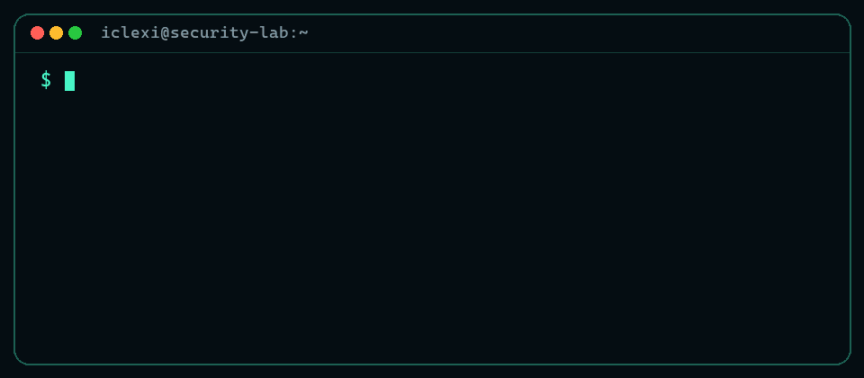

## `// OPERATOR`

I build and document practical systems across **network security, self-hosted infrastructure and full-stack software**. I care about evidence, clear architecture and making security part of the build--not an afterthought.

<h2 align="center"><code>// VPN LAB ORBIT</code></h2>

  
  &nbsp;â—¦&nbsp;
  
   
  ╲ &nbsp;&nbsp; encrypted paths &nbsp;&nbsp; ╱
   
  <strong><code>â—‰ IPSEC / IKEv2 / GRE â—‰</code></strong>
   
  ╱ &nbsp;&nbsp; routed tunnels &nbsp;&nbsp; ╲
   
  
  &nbsp;â—¦&nbsp;
  
   
  

Controlled GNS3 labs · demo-only addressing and credentials · validation evidence

## `// SELECTED BUILDS`

### `01 //` [RitmoHub](https://github.com/iClexi/ritmohub)

Self-hosted music community built with Next.js and PostgreSQL, covering profiles, forums, events, courses, OAuth and Stripe checkout.

`Next.js` `PostgreSQL` `OAuth` `Stripe`

### `02 //` [FortiGate Corporate Security](https://github.com/iClexi/Fortigate-Corporate-Policies)

Evidence-backed FortiGate lab covering segmentation, web/app/DNS filtering, anomaly detection and WAF validation.

`FortiGate` `Segmentation` `WAF` `Security Profiles`

### `03 //` [FortiGate Remote Access VPN](https://github.com/iClexi/VPN-Fortigate-WindowsClient-To-Site)

Controlled FortiGate/FortiClient client-to-site lab with Mode Config, a routed client pool, bidirectional policies and connectivity evidence.

`FortiGate` `FortiClient` `IKEv2` `GNS3`

<!-- Add the Zabbix build here once its repository URL is available, then move VTP to 05. -->

### `04 //` [VTP Attack & Hardening](https://github.com/iClexi/VTP-Attack)

Authorized GNS3 attack-and-mitigation lab demonstrating VTP VLAN database abuse and hardening with transparent mode, VTPv3 and trusted trunk controls.

`Python` `Yersinia` `Cisco IOS` `VTPv3`

<h2 align="center"><code>// AUTHORIZED ATTACK LABS</code></h2>

  
  &nbsp;â—¦&nbsp;
  
   
  ╲ &nbsp;&nbsp; observe · exploit · mitigate &nbsp;&nbsp; ╱
   
  <strong><code>â—‰ L2 ATTACK RANGE â—‰</code></strong>
   
  ╱ &nbsp;&nbsp; authorized labs only &nbsp;&nbsp; ╲
   
  
  &nbsp;â—¦&nbsp;
  
   
  

Controlled GNS3 labs · attack + mitigation · authorized environments only

<h2 align="center"><code>// DEPLOYED WEB APPS</code></h2>

  <a href="https://github.com/iClexi/videodrop">src</a>
  &nbsp;â—¦&nbsp;
  <a href="https://github.com/iClexi/linksgood">src</a>
   
  ╲ &nbsp;&nbsp; public services &nbsp;&nbsp; ╱
   
  <strong><code>â—‰ ICLEXI LIVE SYSTEMS â—‰</code></strong>
   
  ╱ &nbsp;&nbsp; source available &nbsp;&nbsp; ╲
   
  <a href="https://github.com/iClexi/file-metadata-inspector">src</a>
   
  <a href="https://github.com/iClexi/PPT-Del-terror">src</a>
  &nbsp;â—¦&nbsp;
  <a href="https://github.com/iClexi/cryptotoolbox">src</a>

Live badges open the deployed app · <code>src</code> opens its repository

## `// TOOLBOX`

  

 - **Security & networking:** FortiGate, Cisco IOS, IPsec/IKEv2, DMVPN, Wazuh
 - **Systems & platforms:** Linux, Windows Server, Proxmox VE, Docker, Cloudflare
 - **Build & automation:** Python, TypeScript, Shell, Ansible, Terraform

**Training:** Cisco CCNA 1 / 2 / 3 | Cisco Ethical Hacker | Huawei HCIA Datacom

## `// LET'S BUILD SOMETHING SECURE`

I am looking for a junior cybersecurity, infrastructure or systems opportunity where I can keep learning and contribute from day one.

 

Original terminal animation · gradient divider from <a href="https://github.com/Anmol-Baranwal/Cool-GIFs-For-GitHub">Cool GIFs for GitHub</a> (MIT).

