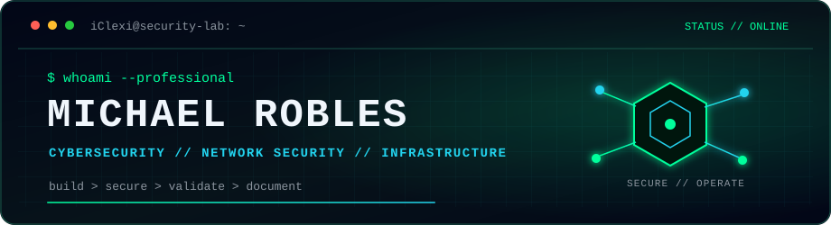

 

[**PORTFOLIO**](https://iclexi.tech) | [**LINKEDIN**](https://www.linkedin.com/in/michael-robles-03798a23a/) | [**EMAIL**](mailto:contacto@iclexi.tech)

## `./whoami`

I am a cybersecurity student focused on **network security and infrastructure**. I build, secure and document hands-on environments across Fortinet and Cisco networking, Linux and Windows Server, Proxmox virtualization, VPNs, monitoring and self-hosted services.

My work emphasizes **reproducible implementations, clear technical evidence and honest scope**: what is implemented, how it was validated and what remains.

> Available for junior roles and internships in cybersecurity, networking, infrastructure or systems administration.

## `./selected-work`

| Project | What it demonstrates |
|---|---|
| [**AgroD**](https://github.com/iClexi/AgroD) / [live](https://agrod.iclexi.tech) | Full-stack AgroTech prototype for farm, crop and device workflows, with owner-scoped data, hardened sessions, Docker and automated checks. `Next.js` `TypeScript` `SQLite` |
| [**RitmoHub**](https://github.com/iClexi/ritmohub) / [live](https://ritmohub.iclexi.tech) | Self-hosted music community built with Next.js and PostgreSQL, covering profiles, forums, events, courses, OAuth and Stripe checkout. `Next.js` `PostgreSQL` `Sentry` |
| [**Proxmox Homelab Infrastructure**](https://github.com/iClexi/Proxmox) | Sanitized infrastructure inventory, service publication and security review for a multi-service Proxmox/Linux homelab. `Proxmox VE` `pfSense` `Wazuh` `Cloudflare` |
| [**FortiGate Corporate Security**](https://github.com/iClexi/Fortigate-Corporate-Policies) | Evidence-backed FortiGate lab covering segmentation, web/app/DNS filtering, anomaly detection and WAF validation. `FortiGate` `WAF` `Network Security` |

## `./toolbox --short`

- **Security & networking:** FortiGate, Cisco IOS, IPsec/IKEv2, DMVPN, Wazuh
- **Systems & platforms:** Linux, Windows Server, Proxmox VE, Docker, Cloudflare
- **Build & automation:** Python, TypeScript, Shell, Ansible, Terraform

## `./training`

`Cisco CCNA 1-3` | `Cisco Ethical Hacker` | `Huawei HCIA Datacom`

## `./connect`

For cybersecurity, networking, infrastructure or automation work: **[explore my portfolio and contact me at iclexi.tech ->](https://iclexi.tech)**

---

`understand protocols // reduce attack surface // document the evidence`

